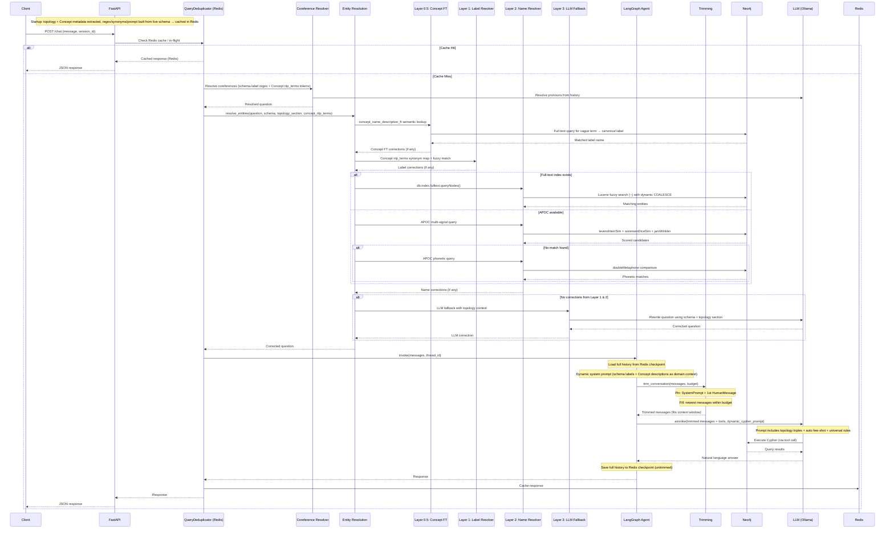
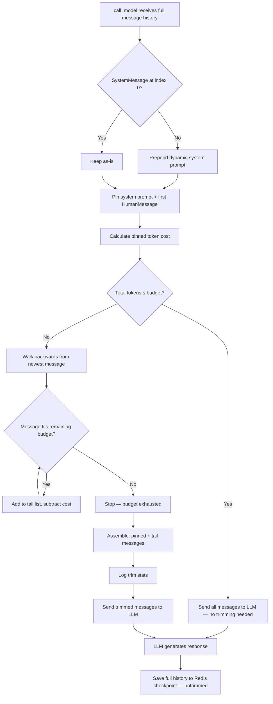

# Neo4j Agent — Redis Variant (`app/`)

Enterprise-grade, **domain-agnostic** knowledge-graph conversational agent built with **FastAPI**, **LangGraph**, **LangChain**, and **Neo4j**. Works out-of-the-box with **any Neo4j database** — no domain-specific configuration required. This variant uses **Redis** for checkpointing, schema caching, topology caching, and query deduplication — fully **multi-worker safe**.

---

## Architecture

```
app/
├── main.py                        # Application factory + lifespan
├── core/
│   ├── config.py                  # Pydantic-settings configuration
│   ├── logging.py                 # Structured logging (structlog)
│   ├── exceptions.py              # Domain exception classes
│   ├── exception_handlers.py      # FastAPI exception handlers
│   └── dependencies.py            # FastAPI Depends providers
├── middleware/
│   ├── auth.py                    # API key authentication
│   └── rate_limit.py              # SlowAPI rate limiter
├── api/
│   ├── routes/
│   │   ├── chat.py                # POST /chat  — conversational endpoint
│   │   ├── health.py              # GET  /health/live, /health/ready
│   │   ├── schema.py              # GET  /schema
│   │   └── sessions.py            # GET|DELETE /sessions
│   └── schemas/
│       ├── chat.py                # Request / response models
│       ├── health.py              # Health-check models
│       └── sessions.py            # Session models
├── services/
│   ├── graph_query.py             # Orchestration: query → agent → response
│   └── query_dedup.py             # Query deduplication (Redis cache + in-flight coalescing)
├── agent/
│   ├── state.py                   # AgentState TypedDict
│   ├── graph.py                   # LangGraph StateGraph (tool-calling agent)
│   ├── factory.py                 # Agent initialisation / compilation
│   ├── trimming.py                # Token-based message trimming (context window)
│   └── checkpointer.py            # Redis-backed LangGraph checkpointer
├── graph/
│   ├── connection.py              # Neo4j driver management
│   ├── topology.py                # Dynamic topology extraction (labels, triples, chains)
│   ├── schema_cache.py            # Redis-backed schema + topology cache with TTL
│   └── cypher/
│       ├── safety.py              # Read-only Cypher validation
│       ├── validation.py          # Query structure + relationship-type validation
│       ├── prompts.py             # Dynamic Cypher prompt builder (topology-aware)
│       ├── dynamic_examples.py    # Auto-generated few-shot examples from live topology
│       ├── topology_filter.py     # Query-aware topology subsetting (Strategy #6)
│       ├── retry.py               # Tenacity retry + topology-enriched self-correction
│       ├── coreference.py         # Pronoun/coreference resolution (dynamic regex)
│       ├── callback.py            # CypherSafetyCallback (safety + rel-type validation)
│       ├── synonyms.py            # Auto-generated synonyms (pattern-based + Concept nlp_terms)
│       └── entity_resolution/     # 4-layer entity resolution pipeline
│           ├── models.py          # Correction / ResolutionResult data classes
│           ├── capabilities.py    # Neo4j capability probes (index, APOC)
│           ├── label_resolver.py  # Layer 1: schema-aware label matching
│           ├── name_resolver.py   # Layer 2: full-text + APOC DB lookups (dynamic COALESCE)
│           └── orchestrator.py    # Layer 0.5 (Concept FT) + Layer 3 (LLM) + pipeline orchestrator
├── llm/
│   └── factory.py                 # Ollama LLM factory
└── mcp/
    ├── server.py                  # FastMCP server setup
    └── tools/
        ├── graph_query.py         # Natural language → graph query tool
        ├── schema_info.py         # Schema introspection tool
        └── vector_search.py       # Vector search tool
```

### Key Components

| Layer | Purpose |
|---|---|
| **FastAPI** | Async HTTP server with lifespan, CORS, auth, rate limiting |
| **LangGraph** | Stateful agent with tool-calling loop, context window trimming, and Redis checkpoints |
| **LangChain** | `GraphCypherQAChain` for natural language → Cypher → answer |
| **Neo4j** | Any knowledge graph database — domain detected automatically from live schema |
| **GraphTopology** | Live-extracted labels, relationship triples (with APOC counts + bidirectionality), and multi-hop chains; drives all dynamic components |
| **Redis** | Session persistence (checkpointer) + schema/topology cache + query dedup cache — multi-worker safe |
| **Ollama** | Local LLM inference (default: `qwen2.5:latest`) |
| **Query Dedup** | Two-layer deduplication: Redis response cache + in-flight coalescing |
| **Entity Resolution** | 4-layer pipeline: Concept FT semantic → label synonyms → APOC fuzzy → LLM fallback (topology-enriched) |
| **Concept Nodes** | Domain metadata (description, nlp_terms) enriches synonyms, coreference regex, prompts, and system context |
| **FastMCP** | Model Context Protocol server mounted at `/mcp` |
| **Prometheus** | Metrics endpoint at `/metrics` |

### How It Differs from `src/` (SQLite Variant)

| Feature | `app/` (Redis) | `src/` (SQLite) |
|---|---|---|
| **Checkpointer** | Redis-backed | SQLite file (or Memory / Redis) |
| **Schema + topology cache** | Redis-backed with TTL | In-memory with TTL |
| **LLM response cache** | Redis-backed | In-memory |
| **External dependencies** | Neo4j + Redis + Ollama | Neo4j + Ollama only |
| **Query dedup cache** | Redis-backed | In-memory TTL dict |
| **Deployment** | Multi-worker safe | Single-process recommended |

### Startup Sequence

The application derives all domain-specific configuration from the live Neo4j schema at startup — nothing is hardcoded:

```
[1] Neo4j connection established
[2] Schema cache warm-up → schema string fetched and cached in Redis
[2b] Topology extraction → GraphTopology built from live Neo4j → cached in Redis
      • Node labels + properties + sample values
      • (A)-[:REL]->(B) relationship triples
      • APOC meta enrichment: relationship counts + bidirectionality (graceful fallback)
      • Multi-hop chains (DFS, max depth 5, max 40 chains)
      • Concept metadata enrichment: description + nlp_terms per label (from Concept nodes)
[2c] Dynamic coreference regex built from schema labels + Concept nlp_terms tokens
      e.g. "that application|app|domain|platform|..." covers label names and curated synonyms
[3]  LangGraph checkpointer (Redis)
[4]  LLM response cache (Redis)
[4b] Query deduplicator (Redis-backed)
[5]  LLM instance created
[5b] Concept-based synonym enrichment (no LLM call needed)
      • Layer A — Pattern-based: CamelCase splits, acronyms, abbreviations
      • Layer B — Concept nlp_terms: domain-curated terms from Concept nodes
      • Layer C — Env-var overrides (highest priority)
[6]  LangGraph agent compiled
      • System prompt built from topology.label_names + Concept descriptions as domain context
      • e.g. "You can answer questions about Application, Domain, Platform, and 4 more"
[7]  FastMCP tools registered
[8]  Ready
```

### Request Flow

```
Client → FastAPI → APIKeyMiddleware → RateLimiter
  → /chat route → QueryDeduplicator (Redis)
    → [CACHE HIT]  → return cached response (no LLM call)
    → [IN-FLIGHT]  → await existing invocation (shared Future)
    → [CACHE MISS]
      → Coreference Resolution
          Dynamic regex built from topology labels at startup
      → Entity Resolution Pipeline
        → Layer 0.5: Concept FT semantic label resolution
            concept_name_description_ft index maps vague terms to canonical labels
        → Layer 1: Label/category correction
            Auto-generated synonyms (pattern-based + Concept nlp_terms) + fuzzy match
        → Layer 2a: Full-text index lookup (if admin-created)
        → Layer 2b: APOC multi-signal (Levenshtein + Sørensen-Dice + Jaro-Winkler)
        → Layer 2c: APOC phonetic (doubleMetaphone)
        → Layer 3: LLM fallback + topology context (only if no corrections found)
      → Query-Aware Topology Filter (topology_filter.py)
          Narrows full topology to labels mentioned in question + one-hop neighbours
          Falls back to full topology if no labels matched
      → Dynamic Cypher Prompt built from filtered topology
          • Topology section: filtered triples with counts, ↔ bidirectionality, filter-by-target hints
          • Multi-hop chain paths, per-label property hints, full valid-types footer
          • Auto-generated few-shot examples (up to 15 patterns, question-relevant triples first)
          • Universal Cypher rules + relationship-type validation (blocks hallucinated rel-types)
      → LangGraph agent
        → Context Window Trimming (token-budget sliding window)
          → Pin: system prompt (domain labels) + first human message
          → Fill: most recent messages within token budget
        → LLM with trimmed history → tool calls → Cypher → Neo4j
        → Retry on failure: topology-enriched correction prompt
      → LLM generates answer → cache result in Redis → response
```

### Entity Resolution Flow Diagram


### Entity Resolution Sequence Diagram



---

## Prerequisites

- **Python** 3.11+
- **Neo4j** 5.x (local or AuraDB cloud) — **any domain**, schema detected automatically
- **Redis** 6.x+ (local or managed)
- **Ollama** with a pulled model (e.g. `ollama pull qwen2.5:latest`)

---

## Setup

### 1. Create Virtual Environment

```bash
python -m venv .venv

# Windows
.venv\Scripts\activate

# Linux/macOS
source .venv/bin/activate
```

### 2. Install Dependencies

```bash
pip install -r app/requirements.txt
```

### 3. Configure Environment

Copy the example env file to the project root and fill in your values:

```bash
cp .env.example .env
```

Required variables:

| Variable | Description | Example |
|---|---|---|
| `NEO4J_URI` | Neo4j connection URI | `bolt://localhost:7687` |
| `NEO4J_USER` | Neo4j username | `neo4j` |
| `NEO4J_PASSWORD` | Neo4j password | `your_password` |
| `REDIS_URL` | Redis connection URL | `redis://localhost:6379` |
| `OLLAMA_BASE_URL` | Ollama API URL | `http://localhost:11434` |
| `OLLAMA_MODEL` | LLM model name | `qwen2.5:latest` |

Optional variables:

| Variable | Default | Description |
|---|---|---|
| `NEO4J_DATABASE` | `neo4j` | Neo4j database name |
| `NEO4J_SKIP_TLS_VERIFY` | `false` | Skip TLS verification (AuraDB) |
| `OLLAMA_TEMPERATURE` | `0.0` | LLM temperature |
| `SCHEMA_CACHE_TTL_SECONDS` | `300` | Schema + topology cache TTL (Redis SETEX) |
| `LLM_CACHE_TTL_SECONDS` | `3600` | LLM response cache TTL |
| `API_KEY` | `` | API key (empty = auth disabled) |
| `CORS_ORIGINS` | `` | Comma-separated allowed origins |
| `RATE_LIMIT_CHAT` | `10/minute` | Chat endpoint rate limit |
| `RATE_LIMIT_GENERAL` | `30/minute` | General rate limit |
| `LOG_LEVEL` | `INFO` | Logging level |
| `DEBUG` | `false` | Debug mode |
| `QUERY_CACHE_TTL_SECONDS` | `1800` | Query dedup response cache TTL (30 min) |
| `QUERY_DEDUP_ENABLED` | `true` | Enable/disable query deduplication |
| `ENTITY_RESOLUTION_ENABLED` | `true` | Enable/disable entity resolution pipeline |
| `ENTITY_FUZZY_THRESHOLD` | `0.75` | Similarity cutoff for fuzzy matching (0.0–1.0) |
| `ENTITY_SYNONYM_OVERRIDES` | `` | JSON string of custom label synonyms (highest priority) |
| `ENTITY_MAX_CANDIDATES` | `5` | Max candidates per DB lookup |
| `ENTITY_FULLTEXT_INDEX_NAME` | `entityNameIndex` | Name of admin-created full-text index |
| `MAX_CONVERSATION_TOKENS` | `100000` | Max token budget for conversation history sent to LLM |
| `TOKEN_BUDGET_RESERVE` | `4096` | Tokens reserved for model output (subtracted from budget) |

### 4. Start Services

Start Neo4j, Redis, and Ollama. You can use Docker Compose from the project root:

```bash
docker-compose up -d neo4j redis ollama
```

Or run them separately if already installed locally.

---

## Running the Application

### Development

```bash
uvicorn app.main:app --host 0.0.0.0 --port 8000 --reload
```

### Production

```bash
uvicorn app.main:app --host 0.0.0.0 --port 8000 --workers 4
```

> **Note:** Redis checkpointer is multi-worker safe. You can run multiple workers behind a load balancer and session history is shared across them.

---

## API Endpoints

| Method | Endpoint | Description |
|---|---|---|
| `POST` | `/chat` | Send a message and get an AI response |
| `GET` | `/health/live` | Liveness probe |
| `GET` | `/health/ready` | Readiness probe (checks Neo4j + Redis + Ollama) |
| `GET` | `/schema` | Get cached Neo4j graph schema |
| `GET` | `/schema/refresh` | Force refresh the schema + topology cache |
| `GET` | `/sessions` | List active sessions |
| `GET` | `/sessions/{id}` | Get session history |
| `DELETE` | `/sessions/{id}` | Delete a session |
| `GET` | `/metrics` | Prometheus metrics |
| `*` | `/mcp` | MCP protocol endpoint |

### Example: Chat (any domain)

```bash
curl -X POST http://localhost:8000/chat \
  -H "Content-Type: application/json" \
  -d '{"message": "Which Applications belong to the CSBB Domain?", "session_id": "user-123"}'
```

Response:

```json
{
  "reply": "The following Applications belong to the CSBB Domain: ...",
  "session_id": "user-123"
}
```

### Example: Health Check

```bash
curl http://localhost:8000/health/ready
```

```json
{
  "status": "healthy",
  "neo4j": "connected",
  "redis": "connected",
  "ollama": "available"
}
```

---

## Project Highlights

- **Domain-agnostic** — Works with any Neo4j database; all prompts, synonyms, coreference patterns, and examples derived dynamically from the live schema at startup
- **Redis-backed** — All caches (schema, topology, LLM responses, query dedup) and session checkpoints stored in Redis for multi-worker safety
- **Dynamic topology extraction** — Labels, relationship triples, and multi-hop chains extracted from live Neo4j; cached in Redis with the same TTL as the schema
- **Query-aware topology filtering** — Narrows full schema to labels mentioned in the question + one-hop neighbours before building the Cypher prompt; reduces noise and keeps the LLM focused
- **Auto-generated Cypher prompts** — Up to 15 few-shot patterns auto-built from filtered topology with real sample values; question-relevant triples prioritised; relationship-type validation blocks hallucinated types
- **APOC meta enrichment** — Relationship counts and bidirectionality annotations added to topology at startup; graceful fallback if APOC is unavailable; cached in Redis with topology
- **Concept node metadata enrichment** — `Concept` nodes in Neo4j carry `description`, `nlp_terms`, and `sample_values` per domain label; loaded at topology extraction and enriches every pipeline layer
- **Concept-node synonym enrichment** — Curated `nlp_terms` from `Concept` nodes replace LLM-generated synonyms; merged with pattern-based synonyms and env-var overrides — no extra LLM call at startup
- **Context window management** — Token-based sliding window trims history before each LLM call; pins system prompt + topic anchor; configurable budget via env vars
- **Query deduplication** — Two-layer dedup reduces redundant LLM calls (Redis response cache + in-flight coalescing)
- **Dynamic entity resolution** — 4-layer pipeline: Concept FT semantic lookup → label synonym matching → APOC fuzzy → LLM fallback; all layers enriched with Concept metadata
- **Topology-enriched retry** — Self-correction prompts include the full topology section and universal Cypher rules for better correction quality
- **Read-only Neo4j compatible** — No write operations; works with read-only accounts on 3M+ node databases
- **APOC-powered fuzzy matching** — Levenshtein + Sørensen-Dice + Jaro-Winkler + phonetic matching
- **Dynamic display property detection** — Heuristic `name > title > label > id > code` replaces hardcoded `COALESCE(node.name, node.title)`
- **Read-only Cypher safety** — All generated queries are validated to prevent writes
- **Automatic retry** — Exponential backoff on transient Neo4j/LLM failures
- **Session persistence** — Conversations persist across restarts via Redis
- **Multi-worker safe** — Redis-backed state shared across all workers; scale horizontally behind a load balancer
- **Rate limiting** — Per-endpoint configurable limits via SlowAPI
- **API key auth** — Optional middleware for production deployments
- **Structured logging** — JSON logs via structlog for observability
- **Prometheus metrics** — Built-in metrics instrumentation
- **MCP support** — Model Context Protocol server for tool interoperability

---

## Entity Resolution (Query Correction)

The entity resolution pipeline automatically corrects user queries before Cypher generation. It runs entirely with **read-only Neo4j access** and scales to **3M+ nodes**. All synonym mappings and label patterns are derived from the live schema — nothing is hardcoded.

### Pipeline Layers

| Layer | Strategy | Latency | How It Works |
|---|---|---|---|
| **0.5 — Concept FT** | Full-text index semantic lookup | ~ 1 ms | Queries `concept_name_description_ft` to map vague terms to canonical label names — runs before fuzzy matching |
| **1 — Label** | Auto-generated synonyms + fuzzy matching | < 1 ms | Pattern-based synonyms (CamelCase, acronym, words) + Concept nlp_terms — all derived from live labels and Concept nodes |
| **2a — Full-text** | Lucene index (admin-created) | ~ 1 ms | Dynamic `COALESCE` over detected display properties |
| **2b — APOC Multi-signal** | Levenshtein + Sørensen-Dice + Jaro-Winkler | 50-500 ms | Label-scoped queries using three averaged similarity metrics |
| **2c — APOC Phonetic** | `doubleMetaphone` matching | 50-500 ms | Sound-alike matching for phonetically similar names |
| **3 — LLM Fallback** | LLM rewrites the question using schema + topology | 1-2 s | Topology section (relationship triples) included for richer context |

### Synonym Generation Layers

| Priority | Source | Description |
|---|---|---|
| Highest | `ENTITY_SYNONYM_OVERRIDES` env var | Manual JSON overrides for edge cases |
| Middle | Concept `nlp_terms` | Domain-curated synonyms from `Concept` nodes in Neo4j — loaded at startup with topology |
| Base | Pattern-based | CamelCase splits, acronyms, abbreviations, underscore forms, individual words |

### Admin Setup (Optional, Recommended)

For optimal performance on large databases, ask your Neo4j admin to create a full-text index:

```cypher
CREATE FULLTEXT INDEX entityNameIndex IF NOT EXISTS
FOR (n) ON EACH [n.name, n.title]
```

The app detects and uses this index automatically. Without it, the APOC fallback is used.

For Layer 0.5 semantic label resolution, create the Concept full-text index:

```cypher
CREATE FULLTEXT INDEX concept_name_description_ft IF NOT EXISTS
FOR (n:Concept) ON EACH [n.name, n.description]
```

This enables the entity resolution pipeline to map vague user terms (e.g. "data product", "app") to canonical label names before fuzzy matching runs.

---

## Context Window Management

Long conversations can exceed the LLM's context window, causing failures or degraded output quality. The agent includes a **token-based sliding window** that trims conversation history before each LLM call.

### How It Works

```
Full checkpoint history (Redis)              Trimmed history (sent to LLM)
┌─────────────────────────────┐            ┌─────────────────────────────┐
│ SystemMessage (domain prompt)│  ── pin ──▶│ SystemMessage (domain prompt)│
│ HumanMessage #1 (topic)     │  ── pin ──▶│ HumanMessage #1 (topic)     │
│ AIMessage #1                │  dropped   │                             │
│ HumanMessage #2             │  dropped   │                             │
│ AIMessage #2                │  dropped   │                             │
│ ...                         │  dropped   │                             │
│ HumanMessage #N-1           │  ── fit ──▶│ HumanMessage #N-1           │
│ AIMessage #N-1              │  ── fit ──▶│ AIMessage #N-1              │
│ ToolMessage (Neo4j results) │  ── fit ──▶│ ToolMessage (Neo4j results) │
│ HumanMessage #N (latest)    │  ── fit ──▶│ HumanMessage #N (latest)    │
└─────────────────────────────┘            └─────────────────────────────┘
```

> **Note:** The system prompt is built dynamically from live schema labels at startup — it reflects the actual entities in your Neo4j database.

### Design Decisions

| Decision | Rationale |
|---|---|
| **Trim at inference time only** | Full history stays in the Redis checkpoint — trimming only occurs when building the prompt for `ainvoke()`. Adjusting the budget later doesn't lose data. |
| **Pin system prompt** | Always preserved so the agent maintains its persona and domain-aware rules. |
| **Pin first human message** | Anchors the conversation topic, preventing context loss when old messages are trimmed. |
| **Fill from newest** | Most recent messages are most relevant; old messages are dropped first. |
| **Approximate token counting** | Uses ~4 chars/token estimator by default. Swap to `model.get_num_tokens()` for exact counting with specific LLM providers. |
| **No summarization** | Adds LLM call latency and complexity. With large context windows (e.g. Gemini 1M+), trimming is primarily a safety net. |

### Configuration

| Variable | Default | Description |
|---|---|---|
| `MAX_CONVERSATION_TOKENS` | `100000` | Total token budget for conversation history |
| `TOKEN_BUDGET_RESERVE` | `4096` | Tokens reserved for model output (subtracted from budget) |

**Effective budget** = `MAX_CONVERSATION_TOKENS` - `TOKEN_BUDGET_RESERVE` (minimum 1024).

### Monitoring

When trimming occurs, the agent logs:

```
INFO  Context window trim: 47 → 12 messages (budget=95904 tokens).
INFO  Trimmed conversation: kept 12/47 messages (dropped 35, budget=95904 tokens).
```

### Context Window Trimming Flow


