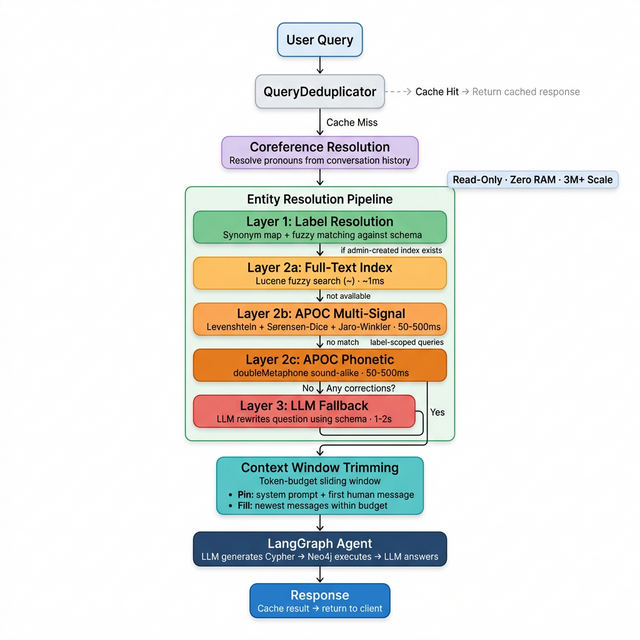
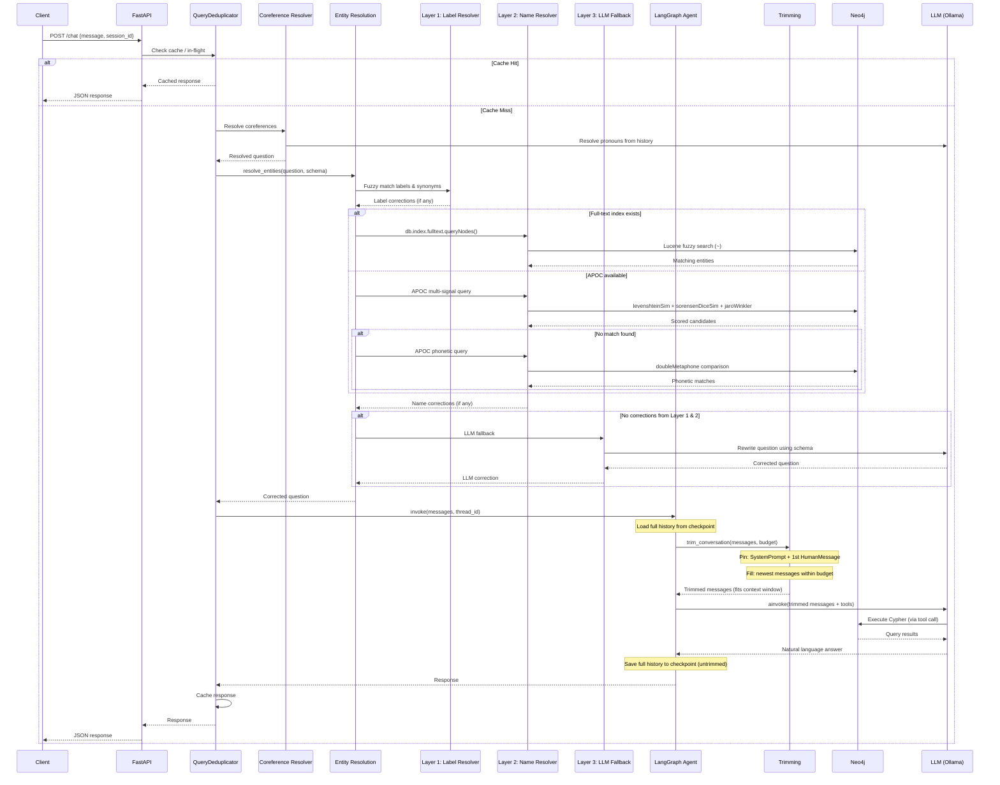
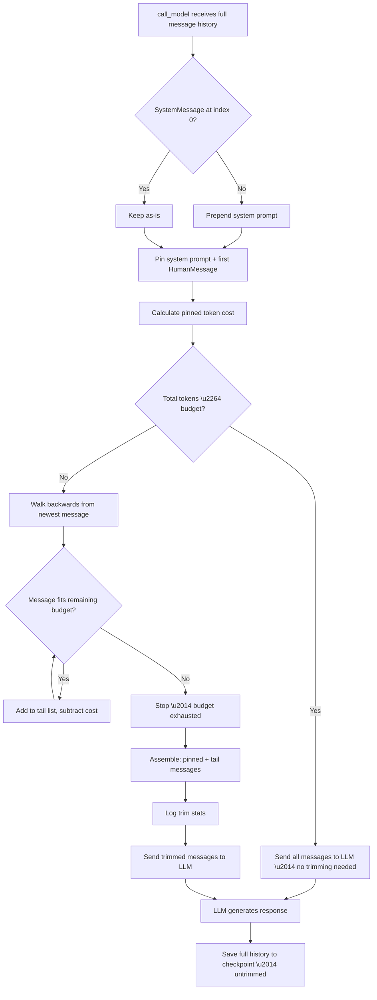

# Neo4j Agent — SQLite Variant (`src/`)

Enterprise-grade knowledge-graph conversational agent built with **FastAPI**, **LangGraph**, **LangChain**, and **Neo4j**. This variant uses **SQLite** for checkpointing and **in-memory caching** — **no Redis required**.

---

## Architecture

```
src/
├── main.py                        # Application factory + lifespan
├── core/
│   ├── config.py                  # Pydantic-settings configuration
│   ├── logging.py                 # Structured logging (structlog)
│   ├── exceptions.py              # Domain exception classes
│   ├── exception_handlers.py      # FastAPI exception handlers
│   └── dependencies.py            # FastAPI Depends providers
├── middleware/
│   ├── auth.py                    # API key authentication
│   └── rate_limit.py              # SlowAPI rate limiter
├── api/
│   ├── routes/
│   │   ├── chat.py                # POST /chat  — conversational endpoint
│   │   ├── health.py              # GET  /health/live, /health/ready
│   │   ├── schema.py              # GET  /schema
│   │   └── sessions.py            # GET|DELETE /sessions
│   └── schemas/
│       ├── chat.py                # Request / response models
│       ├── health.py              # Health-check models
│       └── sessions.py            # Session models
├── services/
│   ├── graph_query.py             # Orchestration: query → agent → response
│   └── query_dedup.py             # Query deduplication (cache + in-flight coalescing)
├── agent/
│   ├── state.py                   # AgentState TypedDict
│   ├── graph.py                   # LangGraph StateGraph (tool-calling agent)
│   ├── factory.py                 # Agent initialisation / compilation
│   ├── trimming.py                # Token-based message trimming (context window)
│   └── checkpointer.py            # Multi-backend: SQLite / Redis / Memory
├── graph/
│   ├── connection.py              # Neo4j driver management
│   ├── schema_cache.py            # In-memory schema cache with TTL
│   └── cypher/
│       ├── safety.py              # Read-only Cypher validation
│       ├── validation.py          # Query structure validation
│       ├── prompts.py             # Enhanced Cypher generation prompt
│       ├── retry.py               # Tenacity retry with exponential backoff
│       ├── coreference.py         # Pronoun/coreference resolution
│       ├── callback.py            # CypherSafetyCallback for LangChain
│       ├── synonyms.py            # Label synonym map (auto + custom)
│       └── entity_resolution/     # 3-layer entity resolution pipeline
│           ├── models.py          # Correction / ResolutionResult data classes
│           ├── capabilities.py    # Neo4j capability probes (index, APOC)
│           ├── label_resolver.py  # Layer 1: schema-aware label matching
│           ├── name_resolver.py   # Layer 2: full-text + APOC DB lookups
│           └── orchestrator.py    # Layer 3 (LLM) + pipeline orchestrator
├── llm/
│   └── factory.py                 # Ollama LLM factory
└── mcp/
    ├── server.py                  # FastMCP server setup
    └── tools/
        ├── graph_query.py         # Natural language → graph query tool
        ├── schema_info.py         # Schema introspection tool
        └── vector_search.py       # Vector search tool
```

### Key Components

| Layer | Purpose |
|---|---|
| **FastAPI** | Async HTTP server with lifespan, CORS, auth, rate limiting |
| **LangGraph** | Stateful agent with tool-calling loop, context window trimming, and SQLite checkpoints |
| **LangChain** | `GraphCypherQAChain` for natural language → Cypher → answer |
| **Neo4j** | Knowledge graph database (movies, actors, directors) |
| **SQLite** | Session persistence (checkpointer) — zero-config, file-based |
| **Ollama** | Local LLM inference (default: `qwen2.5:latest`) |
| **Query Dedup** | Two-layer deduplication: response cache + in-flight coalescing |
| **Entity Resolution** | 3-layer pipeline: label matching → APOC fuzzy → LLM fallback |
| **FastMCP** | Model Context Protocol server mounted at `/mcp` |
| **Prometheus** | Metrics endpoint at `/metrics` |

### How It Differs from `app/` (Redis Variant)

| Feature | `app/` (Redis) | `src/` (SQLite) |
|---|---|---|
| **Checkpointer** | Redis-backed | SQLite file (or Memory / Redis) |
| **Schema cache** | Redis-backed with TTL | In-memory with TTL |
| **LLM response cache** | Redis-backed | In-memory |
| **External dependencies** | Neo4j + Redis + Ollama | Neo4j + Ollama only |
| **Query dedup cache** | Redis-backed | In-memory TTL dict |
| **Deployment** | Multi-worker safe | Single-process recommended |

### Request Flow

```
Client → FastAPI → APIKeyMiddleware → RateLimiter
  → /chat route → QueryDeduplicator
    → [CACHE HIT]  → return cached response (no LLM call)
    → [IN-FLIGHT]  → await existing invocation (shared Future)
    → [CACHE MISS]
      → Coreference Resolution (resolve pronouns from history)
      → Entity Resolution Pipeline
        → Layer 1: Label/category correction (synonym map + fuzzy match)
        → Layer 2a: Full-text index lookup (if admin-created)
        → Layer 2b: APOC multi-signal (Levenshtein + Sørensen-Dice + Jaro-Winkler)
        → Layer 2c: APOC phonetic (doubleMetaphone)
        → Layer 3: LLM fallback (only if no corrections found)
      → LangGraph agent
        → Context Window Trimming (token-budget sliding window)
          → Pin: system prompt + first human message (topic anchor)
          → Fill: most recent messages within token budget
        → LLM with trimmed history → tool calls → Cypher → Neo4j
      → LLM generates answer → cache result → response
```

### Entity Resolution Flow Diagram



### Entity Resolution Sequence Diagram



---

## Prerequisites

- **Python** 3.11+
- **Neo4j** 5.x (local or AuraDB cloud)
- **Ollama** with a pulled model (e.g. `ollama pull qwen2.5:latest`)
- **Redis is NOT required** (optional — configurable via `CHECKPOINTER_BACKEND`)

---

## Setup

### 1. Create Virtual Environment

```bash
python -m venv .venv

# Windows
.venv\Scripts\activate

# Linux/macOS
source .venv/bin/activate
```

### 2. Install Dependencies

```bash
pip install -r src/requirements.txt
```

### 3. Configure Environment

Copy the example env file to the project root and fill in your values:

```bash
cp .env.example .env
```

Required variables:

| Variable | Description | Example |
|---|---|---|
| `NEO4J_URI` | Neo4j connection URI | `bolt://localhost:7687` |
| `NEO4J_USER` | Neo4j username | `neo4j` |
| `NEO4J_PASSWORD` | Neo4j password | `your_password` |
| `OLLAMA_BASE_URL` | Ollama API URL | `http://localhost:11434` |
| `OLLAMA_MODEL` | LLM model name | `qwen2.5:latest` |

Optional variables:

| Variable | Default | Description |
|---|---|---|
| `NEO4J_DATABASE` | `neo4j` | Neo4j database name |
| `NEO4J_SKIP_TLS_VERIFY` | `false` | Skip TLS verification (AuraDB) |
| `OLLAMA_TEMPERATURE` | `0.0` | LLM temperature |
| `CHECKPOINTER_BACKEND` | `sqlite` | Checkpointer: `sqlite`, `redis`, or `memory` |
| `SQLITE_CHECKPOINT_PATH` | `data/checkpoints.db` | SQLite database path |
| `REDIS_URL` | `redis://localhost:6379` | Redis URL (only if backend=redis) |
| `SCHEMA_CACHE_TTL_SECONDS` | `300` | Schema cache TTL |
| `LLM_CACHE_TTL_SECONDS` | `3600` | LLM response cache TTL |
| `API_KEY` | `` | API key (empty = auth disabled) |
| `CORS_ORIGINS` | `` | Comma-separated allowed origins |
| `RATE_LIMIT_CHAT` | `10/minute` | Chat endpoint rate limit |
| `RATE_LIMIT_GENERAL` | `30/minute` | General rate limit |
| `LOG_LEVEL` | `INFO` | Logging level |
| `DEBUG` | `false` | Debug mode |
| `QUERY_CACHE_TTL_SECONDS` | `1800` | Query dedup response cache TTL (30 min) |
| `QUERY_DEDUP_ENABLED` | `true` | Enable/disable query deduplication |
| `ENTITY_RESOLUTION_ENABLED` | `true` | Enable/disable entity resolution pipeline |
| `ENTITY_FUZZY_THRESHOLD` | `0.75` | Similarity cutoff for fuzzy matching (0.0–1.0) |
| `ENTITY_SYNONYM_OVERRIDES` | `` | JSON string of custom label synonyms |
| `ENTITY_MAX_CANDIDATES` | `5` | Max candidates per DB lookup |
| `ENTITY_FULLTEXT_INDEX_NAME` | `entityNameIndex` | Name of admin-created full-text index |
| `MAX_CONVERSATION_TOKENS` | `100000` | Max token budget for conversation history sent to LLM |
| `TOKEN_BUDGET_RESERVE` | `4096` | Tokens reserved for model output (subtracted from budget) |

### 4. Start Services

Start Neo4j and Ollama. You can use Docker Compose from the project root:

```bash
docker-compose up -d neo4j ollama
```

Or run them separately if already installed locally. **Redis is not needed.**

---

## Running the Application

### Development

```bash
uvicorn src.main:app --host 0.0.0.0 --port 8001 --reload
```

### Production

```bash
uvicorn src.main:app --host 0.0.0.0 --port 8001 --workers 1
```

> **Note:** SQLite checkpointer is single-process. Use `--workers 1` or switch to `CHECKPOINTER_BACKEND=redis` for multi-worker deployments.

### Switching Checkpointer Backend

```bash
# SQLite (default) — persistent, file-based
CHECKPOINTER_BACKEND=sqlite

# Redis — persistent, multi-worker safe
CHECKPOINTER_BACKEND=redis
REDIS_URL=redis://localhost:6379

# Memory — no persistence (sessions lost on restart)
CHECKPOINTER_BACKEND=memory
```

---

## API Endpoints

| Method | Endpoint | Description |
|---|---|---|
| `POST` | `/chat` | Send a message and get an AI response |
| `GET` | `/health/live` | Liveness probe |
| `GET` | `/health/ready` | Readiness probe (checks Neo4j + Ollama) |
| `GET` | `/schema` | Get cached Neo4j graph schema |
| `GET` | `/schema/refresh` | Force refresh the schema cache |
| `GET` | `/sessions` | List active sessions |
| `GET` | `/sessions/{id}` | Get session history |
| `DELETE` | `/sessions/{id}` | Delete a session |
| `GET` | `/metrics` | Prometheus metrics |
| `*` | `/mcp` | MCP protocol endpoint |

### Example: Chat

```bash
curl -X POST http://localhost:8001/chat \
  -H "Content-Type: application/json" \
  -d '{"message": "What movies has Tom Hanks acted in?", "session_id": "user-123"}'
```

Response:

```json
{
  "reply": "Tom Hanks has acted in Forrest Gump, Cast Away, The Green Mile, ...",
  "session_id": "user-123"
}
```

### Example: Health Check

```bash
curl http://localhost:8001/health/ready
```

```json
{
  "status": "healthy",
  "neo4j": "connected",
  "ollama": "available"
}
```

---

## Project Highlights

- **No Redis required** — SQLite checkpointer + in-memory caches for simpler deployment
- **Context window management** — Token-based sliding window trims history before each LLM call; pins system prompt + topic anchor; configurable budget via env vars
- **Query deduplication** — Two-layer dedup reduces redundant LLM calls (response cache + in-flight coalescing)
- **Dynamic entity resolution** — 3-layer pipeline corrects typos, wrong labels, and ambiguous names before Cypher generation
- **Read-only Neo4j compatible** — No write operations; works with read-only accounts on 3M+ node databases
- **APOC-powered fuzzy matching** — Levenshtein + Sørensen-Dice + Jaro-Winkler + phonetic matching
- **Read-only Cypher safety** — All generated queries are validated to prevent writes
- **Automatic retry** — Exponential backoff on transient Neo4j/LLM failures
- **Session persistence** — Conversations persist across restarts via SQLite
- **Multi-backend checkpointer** — Switch between SQLite, Redis, or Memory via config
- **Rate limiting** — Per-endpoint configurable limits via SlowAPI
- **API key auth** — Optional middleware for production deployments
- **Structured logging** — JSON logs via structlog for observability
- **Prometheus metrics** — Built-in metrics instrumentation
- **MCP support** — Model Context Protocol server for tool interoperability

---

## Entity Resolution (Query Correction)

The entity resolution pipeline automatically corrects user queries before Cypher generation. It runs entirely with **read-only Neo4j access** and scales to **3M+ nodes**.

### Pipeline Layers

| Layer | Strategy | Latency | Example |
|---|---|---|---|
| **1 — Label** | Schema-aware synonym map + fuzzy matching | < 1 ms | "movies" → `Movie`, "actors" → `Person` |
| **2a — Full-text** | Lucene index (admin-created) | ~ 1 ms | "Matrx" → "The Matrix" |
| **2b — APOC Multi-signal** | Levenshtein + Sørensen-Dice + Jaro-Winkler | 50-500 ms | "Tom Hankes" → "Tom Hanks" |
| **2c — APOC Phonetic** | `doubleMetaphone` matching | 50-500 ms | "Keanu Reaves" → "Keanu Reeves" |
| **3 — LLM Fallback** | LLM rewrites the question using schema | 1-2 s | Complex rewrites |

### Admin Setup (Optional, Recommended)

For optimal performance on large databases, ask your Neo4j admin to create a full-text index:

```cypher
CREATE FULLTEXT INDEX entityNameIndex IF NOT EXISTS
FOR (n) ON EACH [n.name, n.title]
```

The app detects and uses this index automatically. Without it, the APOC fallback is used.

---

## Context Window Management

Long conversations can exceed the LLM's context window, causing failures or degraded output quality. The agent includes a **token-based sliding window** that trims conversation history before each LLM call.

### How It Works

```
Full checkpoint history (SQLite/Redis)      Trimmed history (sent to LLM)
\u250c\u2500\u2500\u2500\u2500\u2500\u2500\u2500\u2500\u2500\u2500\u2500\u2500\u2500\u2500\u2500\u2500\u2500\u2500\u2500\u2500\u2500\u2500\u2500\u2500\u2500\u2500\u2500\u2500\u2500\u2510            \u250c\u2500\u2500\u2500\u2500\u2500\u2500\u2500\u2500\u2500\u2500\u2500\u2500\u2500\u2500\u2500\u2500\u2500\u2500\u2500\u2500\u2500\u2500\u2500\u2500\u2500\u2500\u2500\u2500\u2500\u2510
\u2502 SystemMessage (prompt)      \u2502  \u2500\u2500 pin \u2500\u2500\u25b6\u2502 SystemMessage (prompt)      \u2502
\u2502 HumanMessage #1 (topic)     \u2502  \u2500\u2500 pin \u2500\u2500\u25b6\u2502 HumanMessage #1 (topic)     \u2502
\u2502 AIMessage #1                \u2502  dropped   \u2502                             \u2502
\u2502 HumanMessage #2             \u2502  dropped   \u2502                             \u2502
\u2502 AIMessage #2                \u2502  dropped   \u2502                             \u2502
\u2502 ...                         \u2502  dropped   \u2502                             \u2502
\u2502 HumanMessage #N-1           \u2502  \u2500\u2500 fit \u2500\u2500\u25b6\u2502 HumanMessage #N-1           \u2502
\u2502 AIMessage #N-1              \u2502  \u2500\u2500 fit \u2500\u2500\u25b6\u2502 AIMessage #N-1              \u2502
\u2502 ToolMessage (Neo4j results) \u2502  \u2500\u2500 fit \u2500\u2500\u25b6\u2502 ToolMessage (Neo4j results) \u2502
\u2502 HumanMessage #N (latest)    \u2502  \u2500\u2500 fit \u2500\u2500\u25b6\u2502 HumanMessage #N (latest)    \u2502
\u2514\u2500\u2500\u2500\u2500\u2500\u2500\u2500\u2500\u2500\u2500\u2500\u2500\u2500\u2500\u2500\u2500\u2500\u2500\u2500\u2500\u2500\u2500\u2500\u2500\u2500\u2500\u2500\u2500\u2500\u2518            \u2514\u2500\u2500\u2500\u2500\u2500\u2500\u2500\u2500\u2500\u2500\u2500\u2500\u2500\u2500\u2500\u2500\u2500\u2500\u2500\u2500\u2500\u2500\u2500\u2500\u2500\u2500\u2500\u2500\u2500\u2518
```

### Design Decisions

| Decision | Rationale |
|---|---|
| **Trim at inference time only** | Full history stays in the checkpoint \u2014 trimming only occurs when building the prompt for `ainvoke()`. Adjusting the budget later doesn\u2019t lose data. |
| **Pin system prompt** | Always preserved so the agent maintains its persona and rules. |
| **Pin first human message** | Anchors the conversation topic, preventing context loss when old messages are trimmed. |
| **Fill from newest** | Most recent messages are most relevant; old messages are dropped first. |
| **Approximate token counting** | Uses ~4 chars/token estimator by default. Swap to `model.get_num_tokens()` for exact counting with specific LLM providers. |
| **No summarization** | Adds LLM call latency and complexity. With large context windows (e.g. Gemini 1M+), trimming is primarily a safety net. |

### Configuration

| Variable | Default | Description |
|---|---|---|
| `MAX_CONVERSATION_TOKENS` | `100000` | Total token budget for conversation history |
| `TOKEN_BUDGET_RESERVE` | `4096` | Tokens reserved for model output (subtracted from budget) |

**Effective budget** = `MAX_CONVERSATION_TOKENS` - `TOKEN_BUDGET_RESERVE` (minimum 1024).

### Monitoring

When trimming occurs, the agent logs:

```
INFO  Context window trim: 47 \u2192 12 messages (budget=95904 tokens).
INFO  Trimmed conversation: kept 12/47 messages (dropped 35, budget=95904 tokens).
```

### Context Window Trimming Flow


